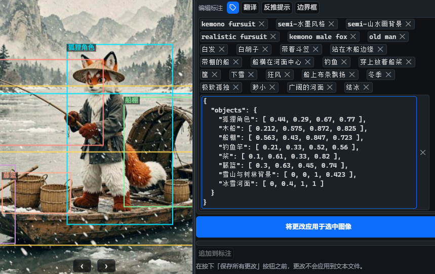

# Dataset Tag Editor
[查看中文版说明](readme.md)  
> *This document is a machine translation and its accuracy cannot be guaranteed.*  

A tool for tagging image generation model training datasets.  
This project is a recreation and enhancement of [Dataset Tag Editor](https://github.com/toshiaki1729/dataset-tag-editor-standalone), originally built on [Neutralinojs](https://neutralino.js.org/).


## Purpose

Built out of long-term usage habits, but the original project has stopped receiving maintenance. I encountered numerous underlying limitations during my own customization and settled for using it as-is for a long time, so I have recreated it and expanded functionality based on my actual needs.


## Features & Highlights

- **Feature Compatibility** – Basic operations and most features are consistent with the original project
- **LLM Auto-tagging** – Supports calling local or online LLMs for automatic tagging
- **Progress Management** – View auto-tagging progress; support adding or removing images to be tagged
- **Custom LLM Functions** – Flexibly configure LLMs for translation, tagging, or other purposes
- **Input Assistance** – Provides auto text completion while typing
- **JSON Support** – Auto expand/collapse JSON and manual boundary box adjustment
- **Keyword Highlighting** – Customizable keyword highlight display rules
- **Mode Switching** – Support editing in text or tag mode
- **Translation Popup** – Call LLM for translation; floating window is draggable and can be pinned
- **File Handling** – Supports batch auto-renaming and deletion of files
- **Lightweight** – The entire application is under 5MB, runs via system WebView, no extra dependencies required
- **Performance Optimization** – Smoother than the original project
- Others: automatic language switching, editing status indicators, separator settings, close confirmation dialogs, multiple image sorting options...


## Feature Screenshots

Translation window & Custom LLM tools


Custom configurations for different functions (you can configure whether thinking mode is enabled for each function)

Custom LLM tools and their configurations (you can customize translation, formatting, polishing, etc. tools)


Tag editing mode & JSON auto expand (some current models support rough percentage-based bounding boxes; ID4 format is too cumbersome, so I don't use it.)



Progress management & highlight rule editing window


## Running & Building


### Windows – Direct Execution
Use the `dataset-tag-editor-win_x64.exe` file inside the project to launch and use directly.

> **Platform Note:** I do not have devices on other platforms, so only Windows operation is guaranteed.


### Running or Building via Neutralinojs

This project is developed using [Neutralinojs](https://neutralino.js.org/). Please ensure you have a Node.js environment installed.

```bash
# 1. Install the Neutralino CLI
npm i -g @neutralinojs/neu

# 2. Run the project
neu run

# 3. Build and create the distribution package
neu build
```